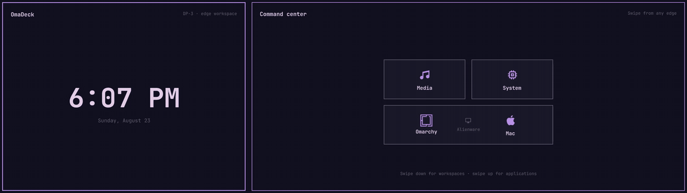
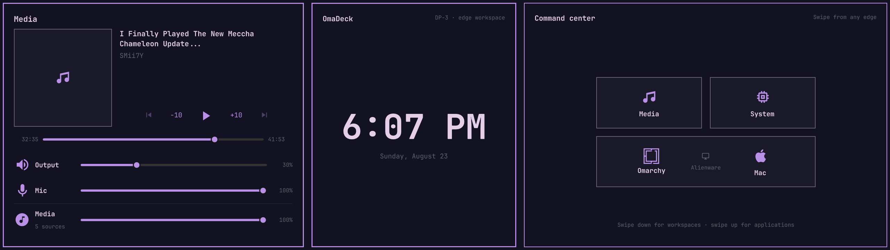
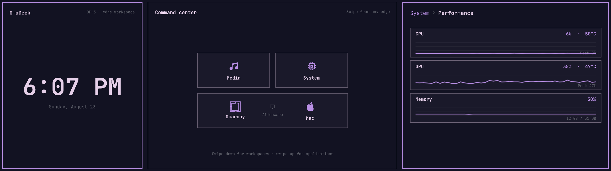
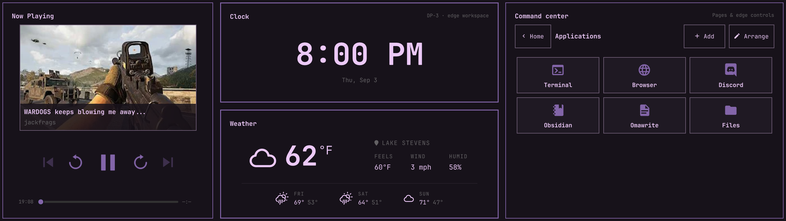

# OmaDeck

OmaDeck is a touch-native command surface for [Omarchy](https://omarchy.org/)
and Hyprland. It turns a secondary touchscreen into a small tiled desktop for
media, audio, applications, workspaces, monitor inputs, clipboard history, and
live system information.

> [!IMPORTANT]
> OmaDeck is an early, hardware-specific release. It currently targets a
> Corsair Xeneon Edge on `DP-3` and a primary workspace monitor on `DP-1`.
> Monitor selection and launcher editing do not have settings screens yet.

<p align="center">
  
</p>

[Higher-quality MP4 demo](assets/omadeck-demo-web.mp4)

## What it does

- Retiles the center surface in step with edge drawers instead of covering it.
- Responsively simplifies dense modules while space is constrained, restoring
  their selected detail as panels expand.
- Controls MPRIS media with artwork, seeking, and transport controls.
- Mixes PipeWire output, microphone, categories, and individual app streams.
- Focuses an existing Hyprland window before launching another copy.
- Switches workspaces on the primary monitor without moving touch focus there.
- Exposes live CPU, GPU, memory, temperature, network, and storage information.
- Provides a touch task manager with Focus, Close, and confirmed Force Kill.
- Browses native Omarchy clipboard history with text and image previews.
- Summons Omarchy's native network and disk speed tests.
- Publishes a mouse-accessible system-tray control center and health report.
- Reconnects its isolated touchscreen automatically after USB, suspend, or
  Quickshell recovery cycles without leaking ownership into child processes.
- Adds current weather, aligned stats, and a multi-day forecast to the clock,
  using Omarchy's location, condition glyphs, and providers.
- Saves touch-configurable clock, weather, detail, visibility, and unit choices.
- Follows the active Omarchy theme, typography, borders, gaps, and motion.

## Gallery

### Media and live audio



### System performance



### Touch launcher



## Install

OmaDeck includes a small native touch bridge and system-tray controller. Add the
plugin without enabling it, build those components, then enable the service:

```bash
omarchy plugin add https://github.com/TheAirick/OmaDeck.git --yes
~/.config/omarchy/plugins/pretty.omadeck/scripts/build-native
omarchy plugin enable pretty.omadeck
```

It starts with `omarchy-shell` at login; no separate autostart service is
required. Building requires CMake, a C++ compiler, and the Qt 6 development
packages used by Omarchy and Quickshell.

After an update, rebuild before restarting the shell:

```bash
omarchy plugin disable pretty.omadeck
omarchy plugin update pretty.omadeck
~/.config/omarchy/plugins/pretty.omadeck/scripts/build-native
omarchy plugin enable pretty.omadeck
```

Remove it with:

```bash
omarchy plugin remove pretty.omadeck
```

Read the [setup and interaction guide](docs/USER_GUIDE.md) before installing on
different hardware.

## Current layout

| Edge | Surface |
| --- | --- |
| Left | Media and audio mixer |
| Right | System overview and tools |
| Top | Workspaces |
| Bottom | Application launcher |

The center starts with Clock/Weather and Command Center modules. Tap the gear in
the clock card to change its layout, time format, weather treatment, detail,
visibility, and units. Revealing a drawer moves it and resizes this split tree
through one shared animated boundary. Cards, controls, and weather details adapt
to their live dimensions throughout the transition.

## Documentation

- [User guide](docs/USER_GUIDE.md)
- [Configuration](docs/CONFIGURATION.md)
- [Troubleshooting](docs/TROUBLESHOOTING.md)
- [Architecture](docs/ARCHITECTURE.md)
- [Roadmap](ROADMAP.md)
- [Contributing](CONTRIBUTING.md)

## Development

Clone the repository and link it into the user plugin directory:

```bash
git clone https://github.com/TheAirick/OmaDeck.git "$HOME/Projects/Omadeck"
ln -s "$HOME/Projects/Omadeck" "$HOME/.config/omarchy/plugins/pretty.omadeck"
```

Add `pretty.omadeck` to the top-level `plugins` array in
`~/.config/omarchy/shell.json`, build the native components, then reload after
edits:

```bash
./scripts/build-native
omarchy-shell shell rescanPlugins
```

OmaDeck is licensed under the [MIT License](LICENSE).
