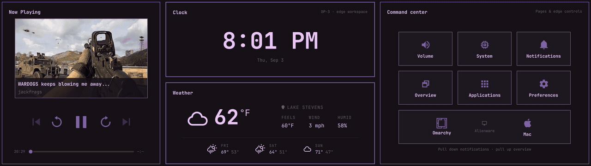
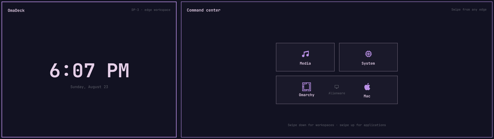
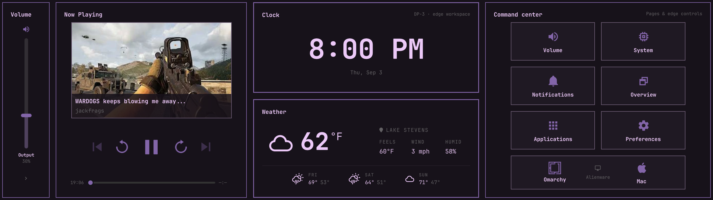
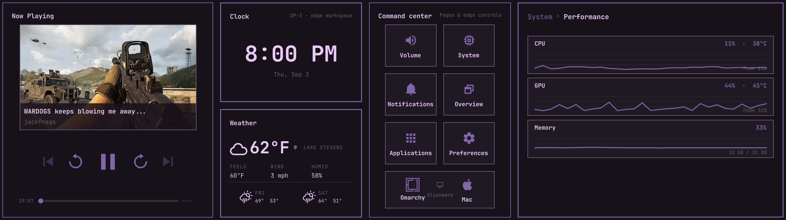
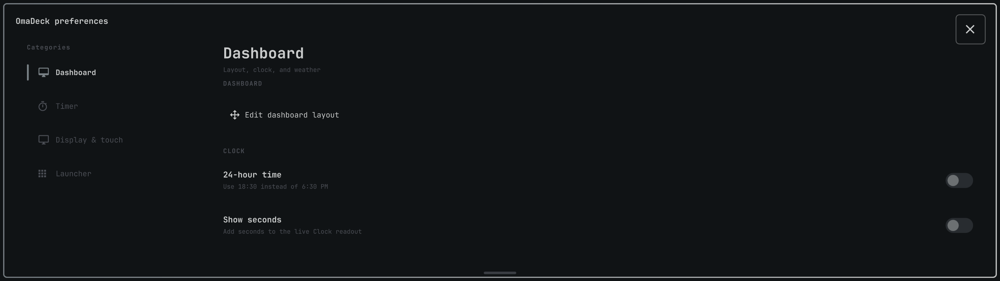
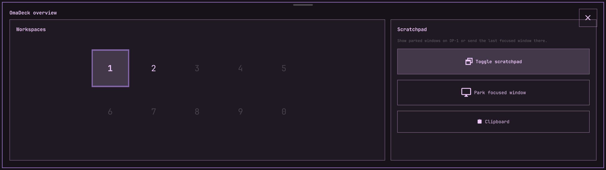
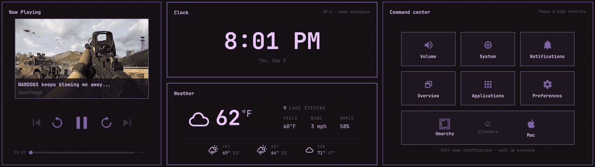

# OmaDeck

OmaDeck is a touch-native command surface for [Omarchy](https://omarchy.org/)
and Hyprland. It turns a secondary touchscreen into a small tiled desktop for
media, audio, applications, workspaces, monitor inputs, clipboard history, and
live system information.

> [!IMPORTANT]
> OmaDeck is an early release built for wide secondary touchscreens such as the
> Corsair Xeneon Edge. On first run it prefers `DP-3`, then falls back to a
> connected secondary display; monitor and touch choices can be changed in
> **Preferences → Display & touch**.

<p align="center">
  
</p>

[Higher-quality drawer demo](assets/omadeck-drawers.mp4)

## What it does

- Keeps Now Playing, Clock/Weather, and Command Center mounted as the permanent
  dashboard while horizontal drawers reserve animated edge geometry.
- Layers Notifications and Workspaces above the dashboard without collapsing or
  dismissing an open Volume or System drawer.
- Responsively simplifies dense modules while space is constrained, restoring
  their selected detail as panels expand.
- Controls MPRIS media with artwork, seeking, and transport controls.
- Controls PipeWire output and microphone volume, with Media, Games, Voice,
  and Other aggregate playback categories. Individual app sliders and EQ presets
  are not part of this release.
- Focuses an existing Hyprland window before launching another copy.
- Switches workspaces on the primary monitor without moving touch focus there.
- Optional monitor input controls configured for your own displays and sources.
- Exposes live CPU, GPU, memory, temperature, network, and storage information.
- Provides a touch task manager with Focus, Close, and confirmed Force Kill.
- Browses native Omarchy clipboard history with text and image previews.
- Summons Omarchy's native network and disk speed tests.
- Optionally publishes a mouse-accessible system-tray control center and health report.
- Reconnects its isolated touchscreen automatically after USB, suspend, or
  Quickshell recovery cycles without leaking ownership into child processes.
- Adds current weather, aligned stats, and a multi-day forecast to the clock,
  using Omarchy's location, condition glyphs, and providers.
- Saves touch-configurable clock, weather, detail, visibility, and unit choices.
- Follows the active Omarchy theme, typography, borders, gaps, and motion.

## Gallery

### Dashboard



### Volume and live audio



### System performance



### Touch launcher


### Preferences



### Workspaces and scratchpad



<p align="center">
  
</p>

[Higher-quality overlay demo](assets/omadeck-overlays.mp4)

## Install

Install and enable OmaDeck with one command:

```bash
omarchy plugin add https://github.com/TheAirick/OmaDeck.git --enable
```

It starts with `omarchy-shell` at login; no separate autostart service or build
step is required. Standard mode uses Hyprland's compositor-managed touch input.

### Optional native integration

OmaDeck also includes an optional native touch bridge and system-tray
controller. Build them to isolate one touchscreen from the desktop pointer,
route it directly into OmaDeck, and add the mouse-accessible tray controller:

```bash
~/.config/omarchy/plugins/pretty.omadeck/scripts/build-native
omarchy restart shell
```

Building requires CMake, a C++ compiler, Python 3, and the Qt 6 development
packages used by Omarchy and Quickshell. Outputs are built and tested in a
fresh private directory, verified, and atomically installed into the plugin
checkout; generated binaries and their integrity record remain local to that
checkout.

On Omarchy hosts that keep the lock service private, independent native touch
also needs the optional [host input guard](integrations/omarchy/README.md) in
the enabled user-owned lock clone. Without a synchronous lock guard, OmaDeck
releases native touch to Hyprland's compositor-managed routing. Keep the actual
touchscreen enabled and mapped as described in [Configuration](docs/CONFIGURATION.md#touch-mapping).
Compositor touch can be affected by game mouse capture; the guarded native
route operates independently of it.

After an update, standard mode is immediately available. If you use the
optional native integration, rebuild it after updating:

```bash
omarchy plugin update pretty.omadeck
~/.config/omarchy/plugins/pretty.omadeck/scripts/build-native
omarchy restart shell
```

Remove it with:

```bash
omarchy plugin remove pretty.omadeck
```

Read the [setup and interaction guide](docs/USER_GUIDE.md) before installing on
different hardware.

## Current layout

| Position | Surface |
| --- | --- |
| Dashboard (customizable) | Now Playing, Clock, Weather/Timer, and Command Center |
| Left swipe | Volume mixer |
| Right swipe | System overview and tools |
| Pull down | Notifications and quick controls overlay |
| Pull up | Workspaces and scratchpad overlay |

Tap the dashboard Clock to set or control one countdown; its normal date line becomes the
remaining-time status while the wall clock stays primary. Clock and weather
appearance is available in **Preferences → Dashboard**, and from the optional
OmaDeck taskbar icon. Choose **Customize layout** there to move panels and resize
their dividers; **Done** saves and **Cancel** restores the previous arrangement.
Timer plus/minus controls repeat and accelerate when held. The Applications
button opens an editable launcher inside Command Center. Horizontal drawers
resize the dashboard through one shared animated boundary; vertical gestures
leave its geometry and drawer state untouched.

## Documentation

- [User guide](docs/USER_GUIDE.md)
- [Configuration](docs/CONFIGURATION.md)
- [Troubleshooting](docs/TROUBLESHOOTING.md)
- [Architecture](docs/ARCHITECTURE.md)
- [Roadmap](ROADMAP.md)
- [Contributing](CONTRIBUTING.md)

## Development

See [Contributing](CONTRIBUTING.md) for development checkout setup, optional
native compilation, and the isolated test suite. End-user installation is
covered by [Install](#install) above; a development checkout is not required.

OmaDeck is licensed under the [MIT License](LICENSE).
